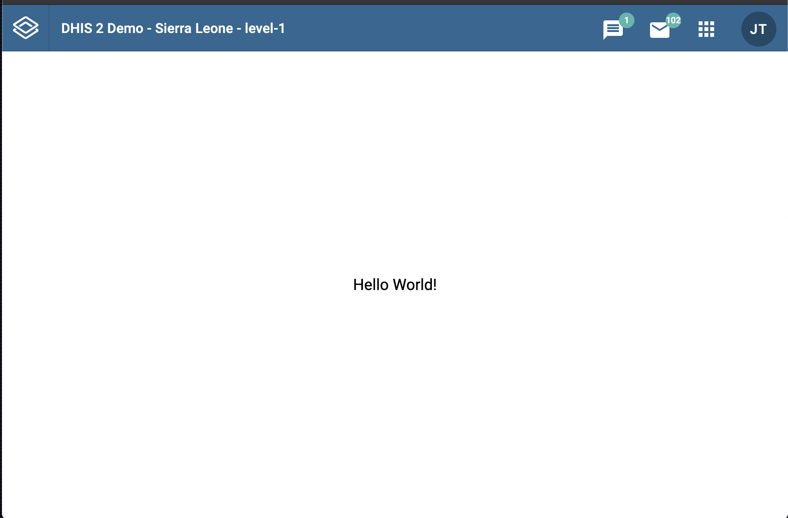

### Applications To Build:
---

  ### Level-1 
  ##### Initializing a local DHIS2 Application:
  ##### Application requirements:
    
       1. Should have: DHIS2 headbar
       2. Should display: Hello World!

  ##### Steps to follow:

   - Go to the level-1 application environment:
   ```bash
   cd level-1
   ```

  - Setup appliction development environment, run the following commands respectively: 
        ```bash
        d2 app scripts init .
        ```
            , install node modules by:
        ```
        yarn install
        ```
            , start the application by:
        ```
            yarn start
        ```

  - Start a DHIS2 server instance:

   ```bash
   // To start a DHIS2 local server, open a new terminal window and run the following command:
   dhis-portal --server=play --instance=2.34.1

   // If dhis-portal is not installed, run the following command and try to run the above command again:
   yarn global add dhis-portal
   ```
    
  For more info about the DHIS2 server instance: to start a DHIS2 server instance and login, please check [ref](https://www.fiftythreetwenty.com/learn/mandatory-exercises/individual/two/dhis2-instance/)

   - If logged-in, it means requirement #1 is completed 🎉:
   - To complete requirement #2, change the existing application to display the following image.
    
  - After displaying 'Hello World!' on your application, requirment #2 is completed 🎉

  - Finally, you can send your local changes to your online github repository: 

    - In the same directory of Level-1, **run** ```yarn test```
    - Now, you might need ```cd ..``` to get to the root directory:
      - add all of your changes by ```git add .```, 
      - commit it by ```git commit -m "commit message"``` and 
      - push the changes by ```git push``` 

  